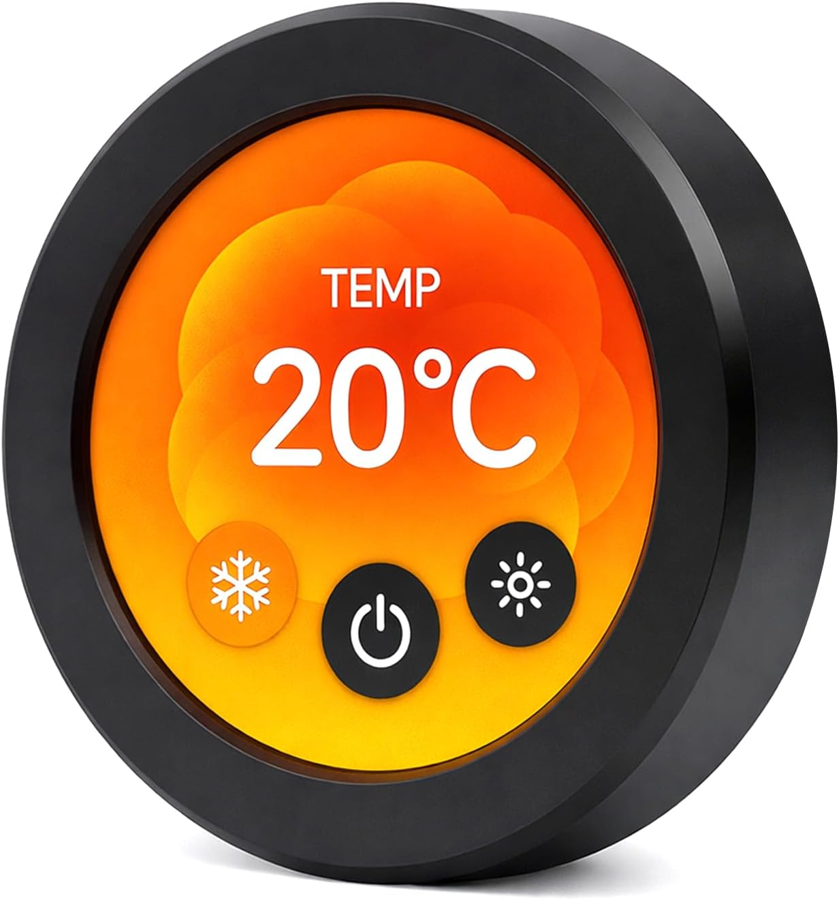
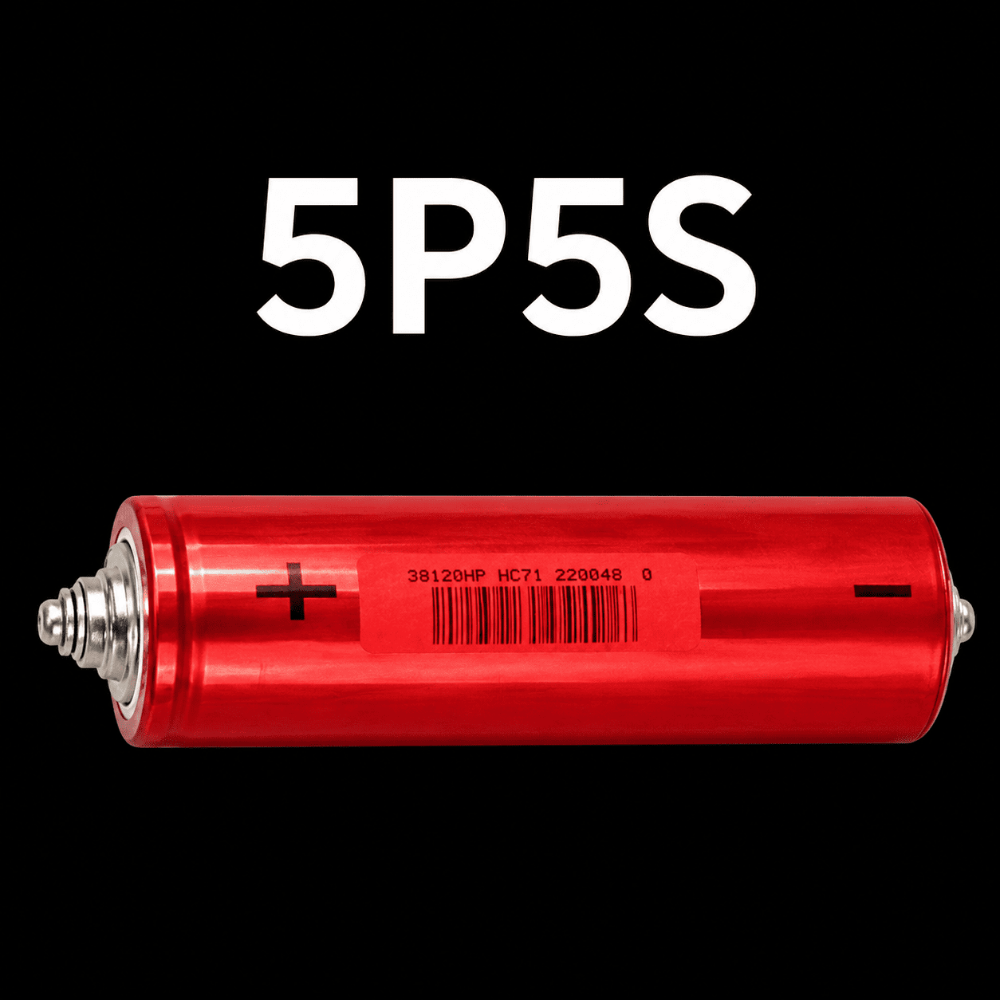

  
  

  
  

# SNAPACK

## Intelligent 12V / 16V LiFePO4 - Jump Pack Monitor

SNAPACK is a custom high-current LiFePO₄ jump pack built around an ESP32-S3 touchscreen controller. The project combines battery instrumentation, high-current contactor control, temperature monitoring, current monitoring, and a modern round touchscreen interface into a compact portable jump-start system.

The electrical architecture is defined and the hardware prototype is actively being built and tested. This repository contains the current build references, firmware requirements, and supporting engineering documentation.
---

## Project Status

* Hardware prototype actively being built and tested
* Electrical architecture defined
* Existing Elecrow ESP32-S3 demonstration project available
* Authoritative hardware build sheet maintained
* Authoritative pin mapping maintained separately
* Software requirements documented
* Modular engineering documentation under development
* Firmware implementation in progress

This is **not** a project starting from a blank sheet of paper. The hardware architecture exists, major interface circuits have been built, and the expected firmware behavior has been documented. Hardware documentation continues to be verified against the physical build.

---

## Development Platform

The intended firmware platform is:

* ESP32-S3
* Arduino Framework
* PlatformIO
* LVGL
* SquareLine Studio
* Elecrow 480×480 Round Display

The existing Elecrow demonstration project is intended to serve as the starting point rather than creating an entirely new user interface.

---

## Repository Contents

### hardware_manifest_revised.txt

The Hardware Manifest is the current authoritative build sheet and primary hardware reference for:

* electrical architecture
* wiring
* sensors
* contactors
* power supplies
* protection
* signal routing
* connector implementation
* working wire-number plan

It is intentionally maintained as a detailed working build document rather than a condensed engineering specification.

### 01_Pin_Maps_Authoritative.txt

This file is the authoritative reference for connector and display pin assignments.

If a pin-number reference elsewhere in the repository conflicts with this file, **01_Pin_Maps_Authoritative.txt takes precedence.**

Display ribbon pin numbers refer to the silkscreen numbering on the back of the Elecrow display PCB. The breakout board is treated only as a straight-through extension and is not assigned a separate numbering system.

### documentation/

The `documentation` folder contains the modular engineering specification set currently being developed from the working hardware documentation.

These files are useful engineering references but remain **in-process documentation** while the physical build is being completed and verified.

Where an in-process modular document conflicts with the current Hardware Manifest or authoritative pin map, the current build references take precedence.

---

### Software_Manifest.txt

The Software Manifest defines the intended firmware behavior, including:

* display layout
* user interface
* monitoring screens
* temperature logic
* current monitoring
* battery resistance monitoring
* safety behavior
* configuration settings
* event logging
* lifetime statistics

Application behavior should follow the Software Manifest unless an engineering issue requires discussion.

---

## Design Philosophy

The project intentionally separates engineering responsibilities.
* Hardware implementation is defined by the current Hardware Manifest, with `01_Pin_Maps_Authoritative.txt` controlling pin assignments.
* Firmware behavior is documented in the Software Manifest.
* SquareLine is used for interface generation.
* Application logic should remain outside SquareLine-generated files whenever practical.

This separation keeps the user interface maintainable while allowing application logic to evolve independently.

---

## Current Firmware Goals

The current implementation focuses on:

* Pack voltage monitoring
* Output current monitoring
* Five temperature sensors
* Battery mode detection (12V / 16V)
* Temperature fault detection
* Peak current recording
* Lifetime statistics
* Relay control for defined fault conditions
* Simple, readable operator interface

The initial goal is a functional diagnostic interface for hardware validation before refinement into a polished production interface.

---

## Contributing

Contributors familiar with the following technologies are especially welcome:

* ESP32-S3
* LVGL
* SquareLine Studio
* PlatformIO
* Arduino
* Embedded C++

Please keep application logic independent from generated UI files whenever practical.

---

## Project Goal

The display exists to answer one simple question:

> **"Is everything OK?"**

If the answer is yes, the interface should remain simple and unobtrusive.

If the answer is no, the display should immediately identify what requires attention.

---

## Project State

This repository documents an actively developed hardware and firmware project.

The electrical architecture is established, while physical construction, verification, and firmware implementation continue. The Hardware Manifest serves as the current working build reference, the authoritative pin map records verified connector assignments, and the modular engineering documents are being refined as the physical build is verified.
